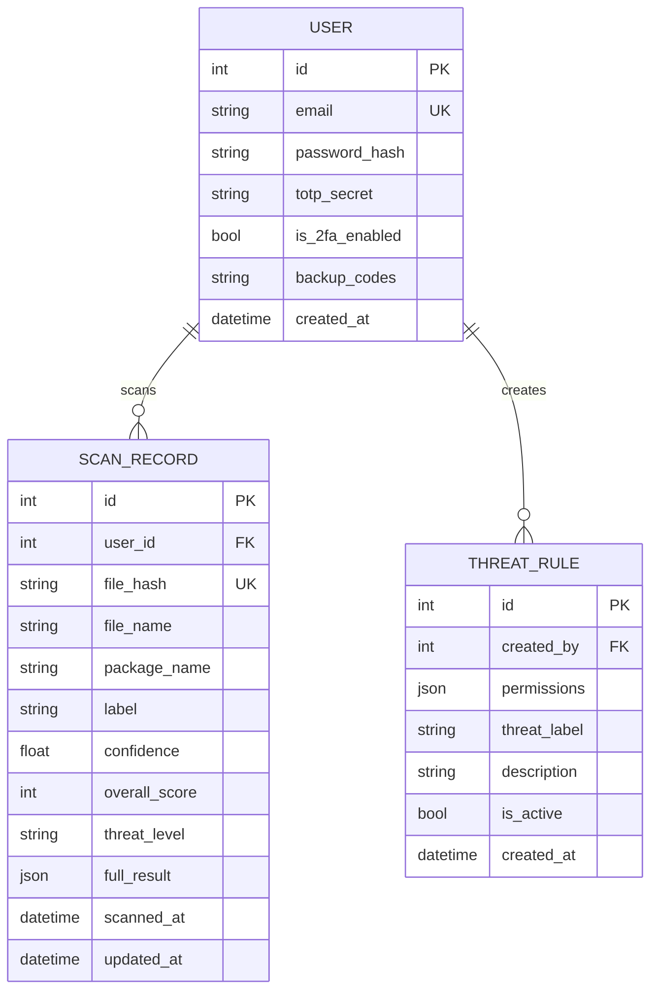

# AndroBlight — Database Schema

> **Reference:** [PRD.md](PRD.md) | [API List.md](API%20List.md)  
> **ORM:** SQLAlchemy (Flask-SQLAlchemy)  
> **Database:** SQLite (development) / PostgreSQL (production)

---

## Entity Relationship Diagram



---

## Model Definitions

### USER

Stores registered user accounts for authentication and cloud sync.

| Column | Type | Constraints | Description |
|---|---|---|---|
| `id` | Integer | PK, Auto-increment | Unique user identifier |
| `email` | String(255) | Unique, Not Null, Indexed | Login email address |
| `password_hash` | String(255) | Not Null | Bcrypt hashed password |
| `totp_secret` | String(32) | Nullable | TOTP secret for 2FA (Feature 9) |
| `is_2fa_enabled` | Boolean | Default: False | Whether 2FA is active |
| `backup_codes` | Text | Nullable | JSON array of hashed backup codes |
| `created_at` | DateTime | Default: now() | Account creation timestamp |

**Introduced in:** Chunk 2  
**Updated in:** Chunk 6 (adds 2FA fields)

```python
# SQLAlchemy model
class User(db.Model):
    __tablename__ = 'users'
    
    id = db.Column(db.Integer, primary_key=True)
    email = db.Column(db.String(255), unique=True, nullable=False, index=True)
    password_hash = db.Column(db.String(255), nullable=False)
    totp_secret = db.Column(db.String(32), nullable=True)          # Chunk 6
    is_2fa_enabled = db.Column(db.Boolean, default=False)          # Chunk 6
    backup_codes = db.Column(db.Text, nullable=True)               # Chunk 6
    created_at = db.Column(db.DateTime, default=datetime.utcnow)
    
    # Relationships
    scans = db.relationship('ScanRecord', backref='user', lazy='dynamic')
    rules = db.relationship('ThreatRule', backref='creator', lazy='dynamic')
```

---

### SCAN_RECORD

Stores scan results persistently (replaces `scan_cache.json`).

| Column | Type | Constraints | Description |
|---|---|---|---|
| `id` | Integer | PK, Auto-increment | Unique scan identifier |
| `user_id` | Integer | FK → users.id, Nullable | Owner (null = anonymous scan) |
| `file_hash` | String(64) | Unique, Indexed | SHA-256 hash of scanned file |
| `file_name` | String(255) | Nullable, Indexed | Original filename or package name |
| `package_name` | String(255) | Nullable, Indexed | Android package name (e.g., com.whatsapp) |
| `label` | String(20) | Not Null | "Malware" or "Benign" |
| `confidence` | Float | Not Null | Model confidence (0.0 - 1.0) |
| `overall_score` | Integer | Not Null | Combined risk score (0 - 100) |
| `threat_level` | String(20) | Not Null | "SAFE", "LOW", "MEDIUM", "HIGH", "CRITICAL" |
| `full_result` | JSON | Not Null | Complete scan result JSON |
| `scanned_at` | DateTime | Default: now() | When the scan was performed |
| `updated_at` | DateTime | Nullable | Last rescan update timestamp |

**Introduced in:** Chunk 2  
**Used by:** Features 2 (rescanning), 3 (cloud sync), 5 (filtering)

```python
class ScanRecord(db.Model):
    __tablename__ = 'scan_records'
    
    id = db.Column(db.Integer, primary_key=True)
    user_id = db.Column(db.Integer, db.ForeignKey('users.id'), nullable=True)
    file_hash = db.Column(db.String(64), unique=True, index=True)
    file_name = db.Column(db.String(255), nullable=True, index=True)
    package_name = db.Column(db.String(255), nullable=True, index=True)
    label = db.Column(db.String(20), nullable=False)
    confidence = db.Column(db.Float, nullable=False)
    overall_score = db.Column(db.Integer, nullable=False)
    threat_level = db.Column(db.String(20), nullable=False)
    full_result = db.Column(db.JSON, nullable=False)
    scanned_at = db.Column(db.DateTime, default=datetime.utcnow)
    updated_at = db.Column(db.DateTime, nullable=True)
```

---

### THREAT_RULE

User-defined custom threat detection rules.

| Column | Type | Constraints | Description |
|---|---|---|---|
| `id` | Integer | PK, Auto-increment | Unique rule identifier |
| `created_by` | Integer | FK → users.id, Not Null | Rule author |
| `permissions` | JSON | Not Null | Array of Android permissions to match |
| `threat_label` | String(100) | Not Null | Threat name (e.g., "SMS Trojan") |
| `description` | Text | Nullable | Human-readable explanation |
| `is_active` | Boolean | Default: True | Whether rule is active |
| `created_at` | DateTime | Default: now() | Rule creation timestamp |

**Introduced in:** Chunk 5

```python
class ThreatRule(db.Model):
    __tablename__ = 'threat_rules'
    
    id = db.Column(db.Integer, primary_key=True)
    created_by = db.Column(db.Integer, db.ForeignKey('users.id'), nullable=False)
    permissions = db.Column(db.JSON, nullable=False)
    threat_label = db.Column(db.String(100), nullable=False)
    description = db.Column(db.Text, nullable=True)
    is_active = db.Column(db.Boolean, default=True)
    created_at = db.Column(db.DateTime, default=datetime.utcnow)
```

**Example rule JSON:**
```json
{
  "id": 1,
  "permissions": ["SEND_SMS", "INTERNET", "READ_CONTACTS"],
  "threat_label": "SMS Trojan",
  "description": "App can read contacts and send SMS over the internet — possible premium SMS fraud",
  "is_active": true
}
```

---

## Indexes

| Table | Column(s) | Type | Purpose |
|---|---|---|---|
| `users` | `email` | Unique | Login lookup |
| `scan_records` | `file_hash` | Unique | Deduplicate scans |
| `scan_records` | `file_name` | Standard | History search (Feature 5) |
| `scan_records` | `package_name` | Standard | History search (Feature 5) |
| `scan_records` | `user_id` + `scanned_at` | Composite | Cloud sync queries |

---

## Migration Strategy

| Phase | What | How |
|---|---|---|
| Chunk 2 | Create tables | `flask db init` → `flask db migrate` → `flask db upgrade` |
| Chunk 2 | Migrate `scan_cache.json` | One-time script reads JSON, inserts into `scan_records` |
| Chunk 5 | Add `threat_rules` table | `flask db migrate` → `flask db upgrade` |
| Chunk 6 | Add 2FA columns to `users` | `flask db migrate` → `flask db upgrade` |
