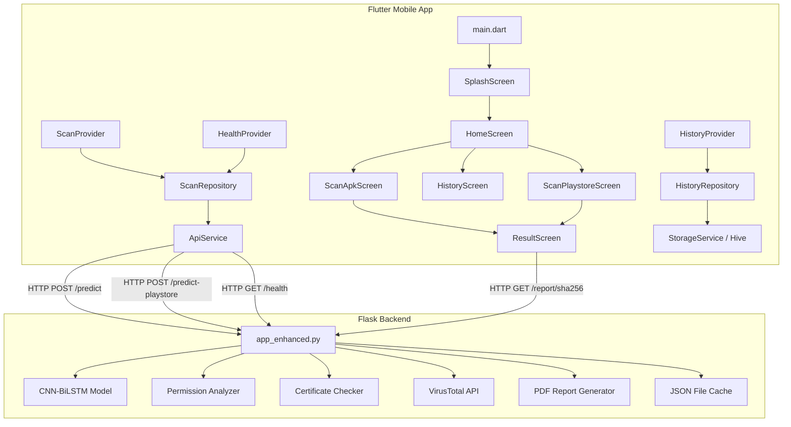
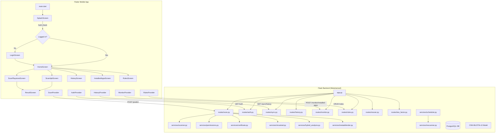
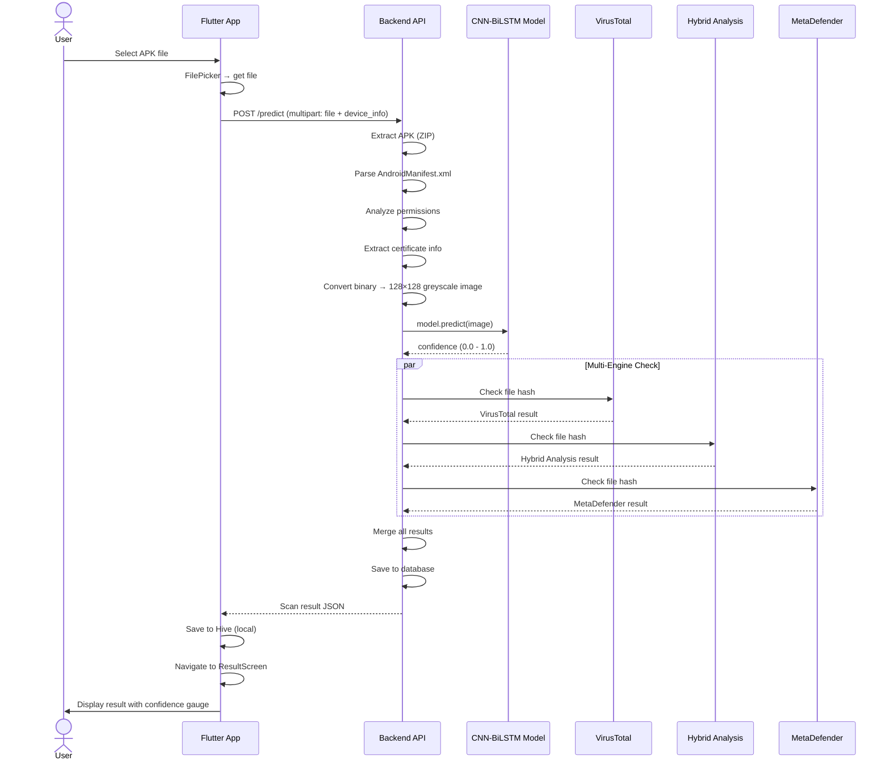
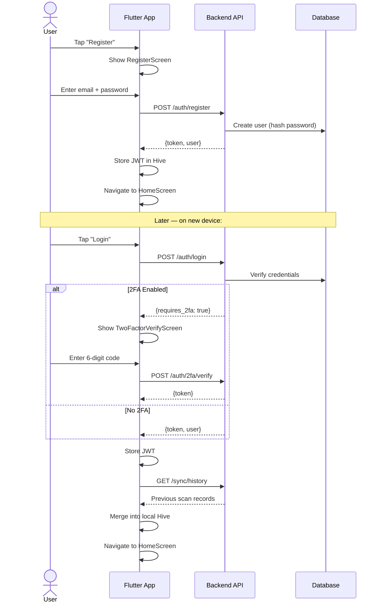
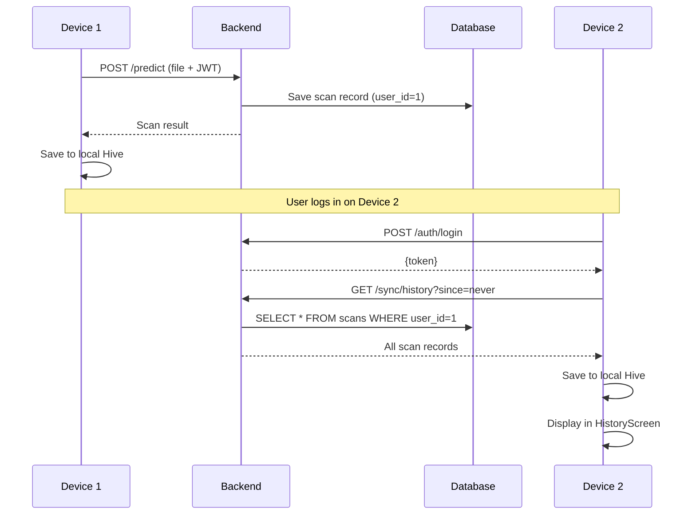
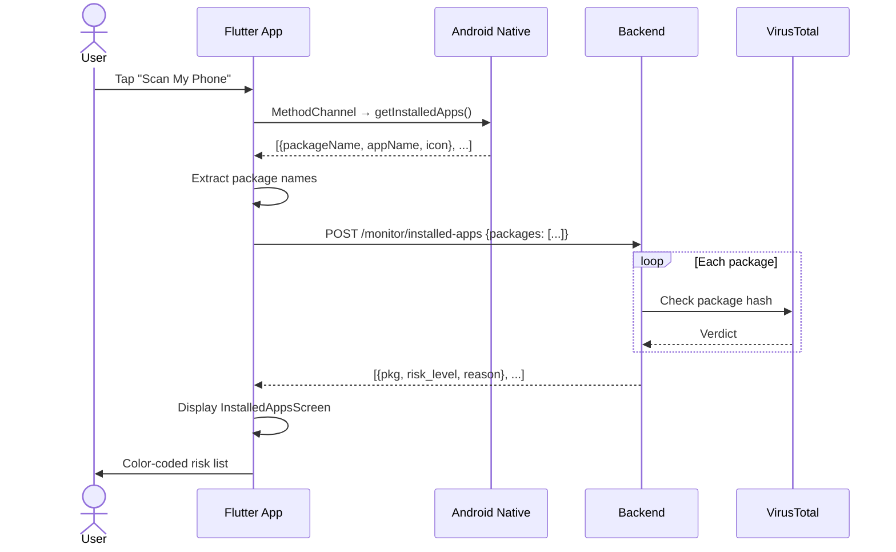
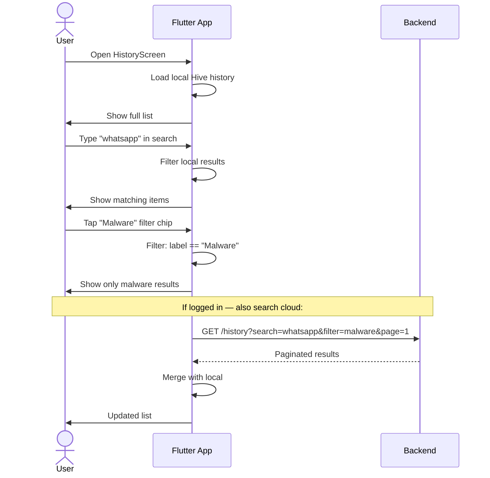
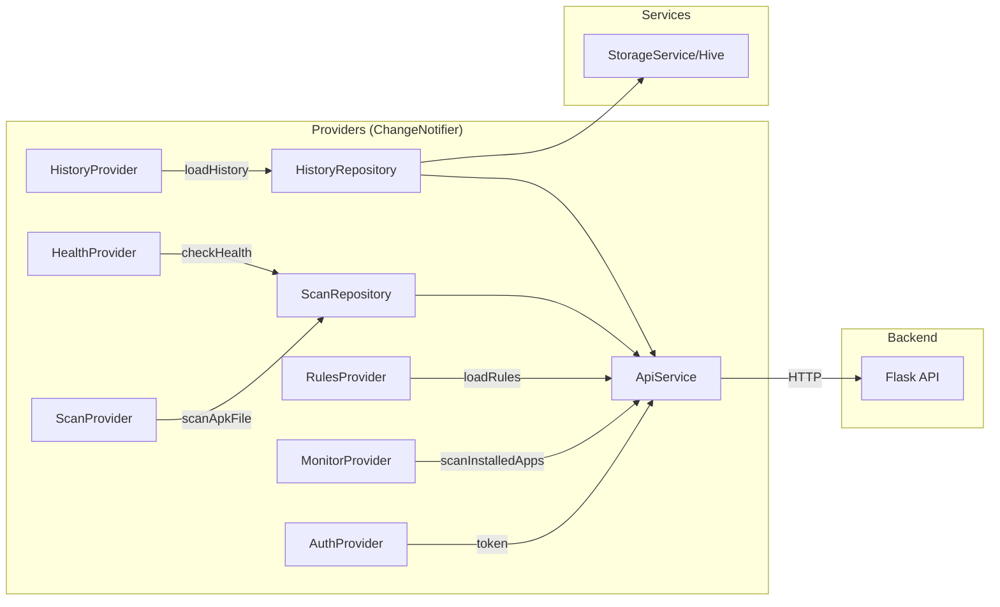
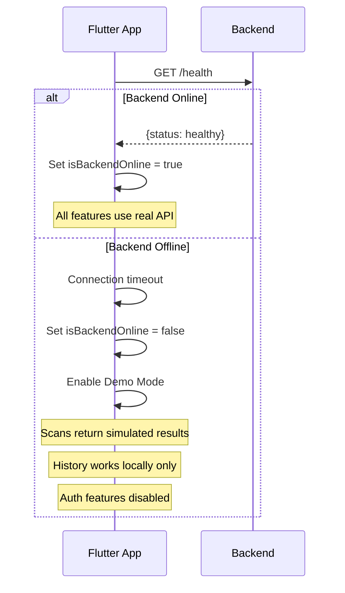

# AndroBlight — User Flow Diagrams

> **Reference:** [PRD.md](PRD.md) | [Detailed Feature.md](Detailed%20Feature.md) | [API List.md](API%20List.md)

---

## 1. Current Architecture

---

## 2. Target Architecture (After All Chunks)

---

## 3. Core User Flows

### Flow 1: APK Scan (Current + Enhanced)

### Flow 2: User Registration & Login

### Flow 3: Cloud Sync

### Flow 4: Installed App Monitoring

### Flow 5: History Search & Filter

---

## 4. State Management Flow

---

## 5. Demo Mode Flow

The Flutter app has a `devMode` flag in `constants.dart` that can be toggled to force demo mode even when the backend is available. This is useful for development and presentations.
